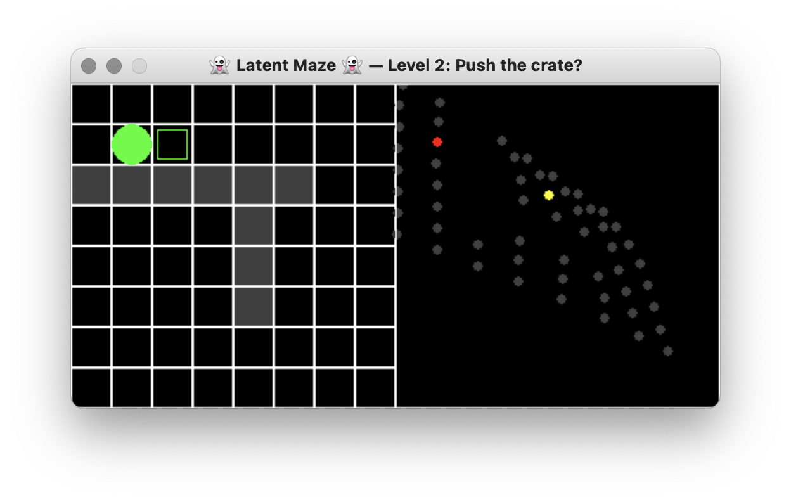

# Latent Maze

A small game created during the [5th International Summer School on Artificial Intelligence and Games](https://school.gameaibook.org) in 2023 that demonstrates how a visualisation that enumerates all the possible states of a level in a game can be used as a puzzle game mechanic.

## Installation

To play Latent Maze, use Python 3.10 or later and install dependencies using `pip install -r requirements.txt`. We recommended doing this within an environment created using tools such as [Miniconda](https://conda.io/miniconda.html) or [Virtualenv](https://virtualenv.pypa.io/en/latest/). Then run the program using `python main.py`.

## Credits

This game was created by:

- [Jontahan Jørgensen](https://github.com/Jontahan)
- [Niels NTG Poldervaart](https://github.com/Niels-NTG)
- [Dante Camarena](https://github.com/MHDante)
